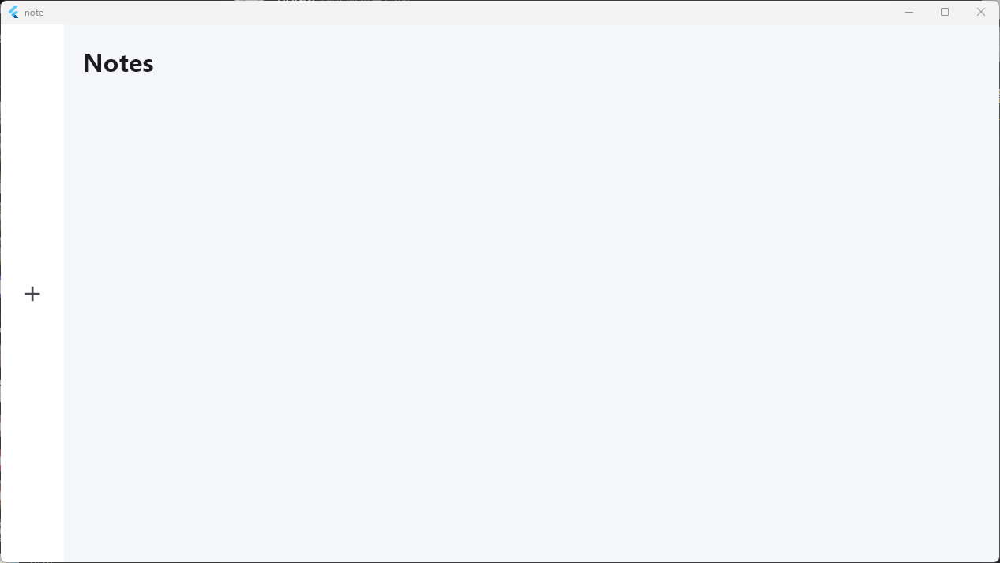
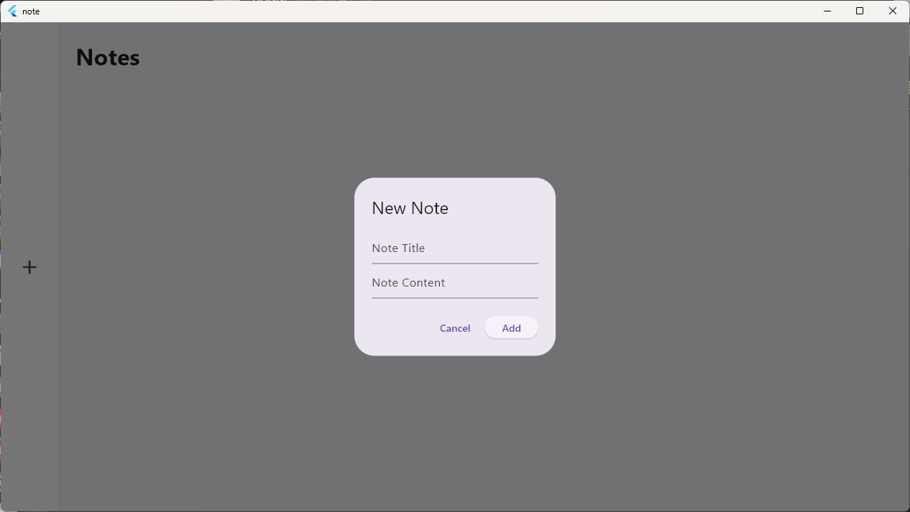
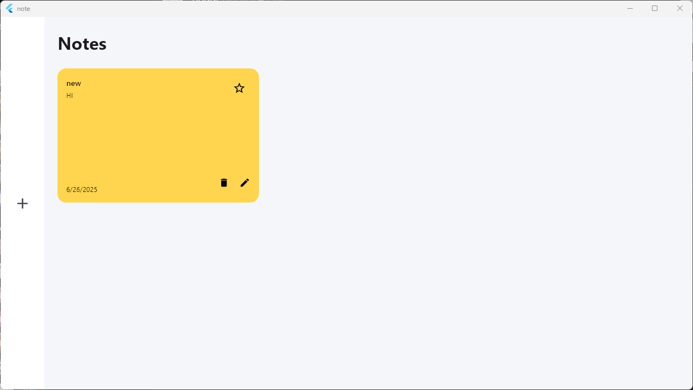

# Note App

## 소개
> 노트 flutter 웹/모바일 애플리케이션

---

## 사용된 기술 스택

> flutter

---

## 페이지 화면

## Main page

    

> 아직 메모가 추가되지 않은 경우의 초기 화면입니다.  
> 좌측 + 버튼을 눌러 새 메모를 생성할 수 있습니다.  
> 직관적인 사용자 흐름을 위해 초기 상태에서도 기능 접근이 용이하게 디자인되었습니다.

 

## Add New Note 

    

> Note Title와 Note Content를 입력  
> Add 버튼으로 메모 추가  
> Cancel 버튼으로 창 닫기

 

## Notes List View

    

> 상단에는 메모 제목과 내용 일부 표시  
> 하단에는 작성일자와 함께 삭제, 수정, 즐겨찾기 기능 제공  